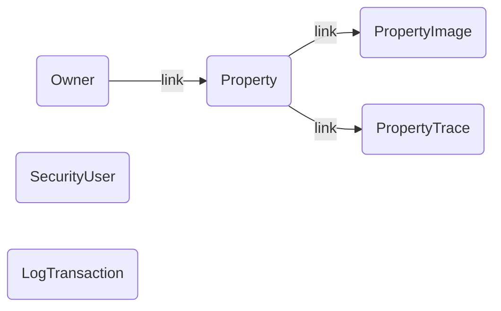
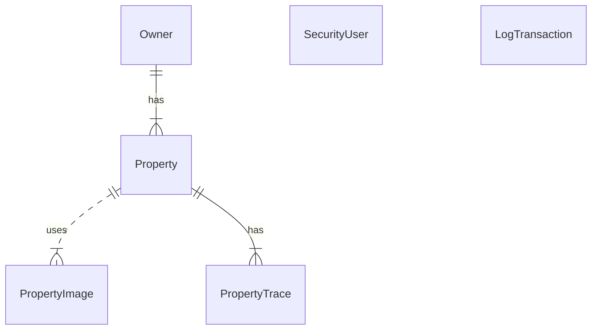
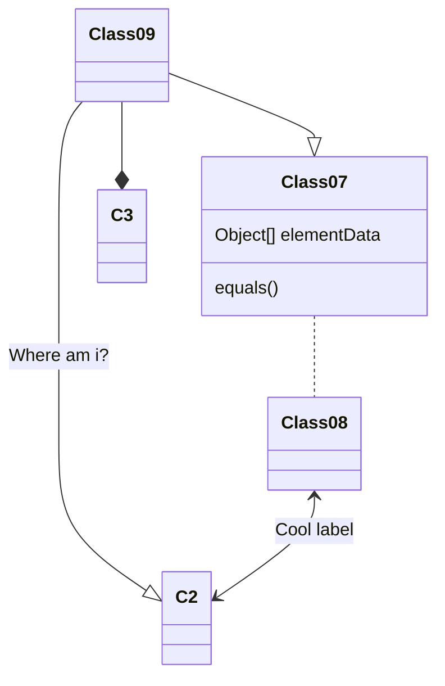
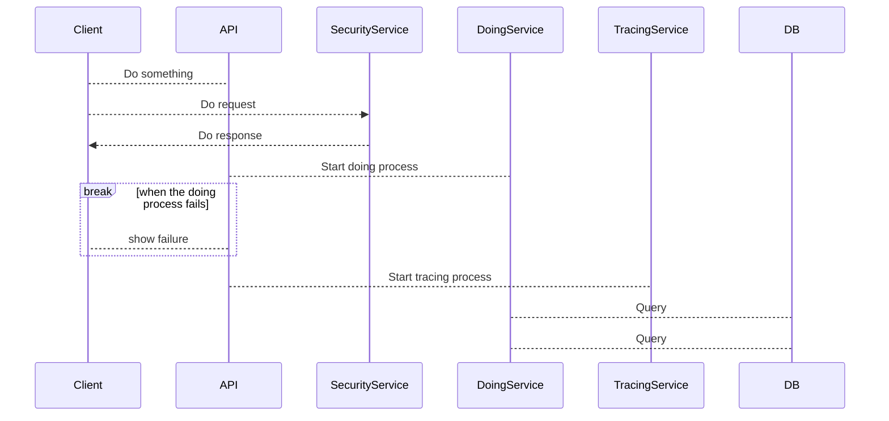

# Real Estate Service API

[](https://github.com/javiardodev/PruebaMillion/stargazers) [](https://github.com/javiardodev/PruebaMillion/fork)  [](https://github.com/javiardodev/PruebaMillion/blob/main/LICENSE)

# Overview

This project is a technical solution for managing real estate properties in the United States. The API is built using .NET 8, focusing on development best practices, including a modular architecture, unit testing with XUnit, and principles of security and performance.

The API enables key operations such as creating and updating properties, managing images, modifying prices, and querying properties with advanced filters. Additionally, it is designed to be extensible, scalable, and easy to maintain.

# Getting Started

## Technologies

- [.NET 8 SDK](https://dotnet.microsoft.com/download/dotnet/8.0) (lastest LTS): [What is dotnet?](https://dotnet.microsoft.com/es-es/learn/dotnet/what-is-dotnet)
- ASP.NET Core: [What is Asp.net Core?](https://dotnet.microsoft.com/es-es/learn/aspnet/what-is-aspnet-core)
- Entity Framework Core: [What is EF Core?](https://learn.microsoft.com/es-es/ef/core/)
- SQL Server 2019 v15: [What is SQL Server?](https://learn.microsoft.com/es-es/sql/sql-server/what-is-sql-server?view=sql-server-ver15)
- Swashbackle (Swagger): [What is Swagger?](https://swagger.io/resources/open-api/)
- FluentValidations: [What is FluentValidations?](https://docs.fluentvalidation.net/en/latest/index.html)
- HealthChecks: [What is HealthChecks?](https://learn.microsoft.com/en-us/aspnet/core/host-and-deploy/health-checks?view=aspnetcore-8.0)
- JWT Signature: [What is Jwt?](https://jwt.io/)
- Docker Compose: [What is Docker?](https://www.docker.com/)
- Git: [What is Git?](https://git-scm.com/book/es/v2/Inicio---Sobre-el-Control-de-Versiones-Acerca-del-Control-de-Versiones)
- SeriLog: [What is SeriLog?](https://serilog.net/)
- XUnit: [What is XUnit?](https://xunit.net/)

## Installation Local or Codespaces

To Install this project, choose a option ssh, download zip file, clone on bash or GitHub CLI.

- SSH

```sh
git clone git@github.com:javiardodev/PruebaMillion.git
```

- Console or Terminal

```sh
git clone https://github.com/javiardodev/PruebaMillion.git
cd PruebaMillion
```

- Download zip file and unzip

```sh
curl https://github.com/javiardodev/PruebaMillion/archive/refs/heads/main.zip
```

- GitHub CLI

```sh
gh repo clone javiardodev/PruebaMillion
```

## Deployment Enviroment or Debug

To deploy this project, using:

- Docker compose

```sh
docker compose up -d --profile backend
```

Then, you can to go on your browser and access link URL `http://localhost:8080/swagger/`

Also you can use .NET CLI

```sh
dotnet restore
dotnet run --project src/RealEstate.Api
```

***If you prefer, you can to run project since Visual Studio IDE Local.***

Open the solution set click right over solution next click in "Restore nuget package" and press `CTRL + F5` for run without debuging.

After, you can to access the Swagger UI at `http://localhost:5013/swagger/index.html` on your browser.

## Structure Project

The project follows a Clean Architecture approach, ensuring a clear separation of concerns and maintainability. It is structured into multiple layers:

- **Domain Layer:** Contains core business logic and domain entities.
- **Application Layer:** Manages use cases and application-specific logic.
- **Infrastructure Layer:** Handles data access, external services, and framework-specific implementations.
- **Presentation Layer:** Provides the API endpoints and serves as the entry point for client interactions.
- **Cross-Cutting Layer:** Includes shared functionalities such as logging, validation, and exception handling, ensuring consistent behavior across all layers.
- **Test Layer:** Includes unit and integration tests to ensure the reliability and correctness of the solution.

This architecture promotes scalability, testability, and adherence to best practices.

## Features/Use cases

### Property

- Create Property Building
- Change Price
- Update property
- List property with filters

### PropertyImage

- Add Image from property

### Owner

- Create an Owner

### Security

- Generate JWT

## API Reference

### SecurityController

- **Generate Jwt**

    ***Action:*** Create a new token authorization

    ***Endpoint:***

    ```http
    POST /api/security/token
    ```

    ***Request:***

    ```json
    {
        "username": "usrRealEstate",
        "password": "usrRealEstate",
    }
    ```

    ***Rsponse:***

    ```json
    {
        "token": "usrRealEstate"
    }
    ```

### PropertyController

- **Get properties**

    ***Action:*** Returned properties list paging by filters

    ***Endpoint:***

    ```http
    GET /api/property/items
    ```

    ***Resquest:***

    | Parameter | Type     | Description                |
    | :-------- | :------- | :------------------------- |
    | `token`   | `string` | **Required**. Authorization |
    | `name`    | `string` | **Optional**. Property name |
    | `address` | `string` | **Optional**. Property Address |
    | `minPrice`| `string` | **Optional**. Property min value |
    | `maxPrice`| `string` | **Optional**. Property max value |
    | `year`    | `string` | **Optional**. Property year built |

    ***Response:***

    ```json
    {

    }
    ```

- **Get property**

    ***Action:*** Return property by id

    ***Endpoint:***

    ```http
    GET /api/property/item/${id}
    ```

    ***Request:***

    | Parameter | Type     | Description                       |
    | :-------- | :------- | :-------------------------------- |
    | `token`      | `string` | **Required**. Authorization |
    | `id`      | `string` | **Required**. Id of item to fetch |

    ***Response:***

    ```json
    {
        "id": 1
    }
    ```

### PropertyImageController

- **Set property image**

    ***Action:*** Add a image for property

    ***Endpoint:***

    ```http
    GET /api/propertyimage/${id}/images
    ```

    ***Request:***

    | Parameter | Type     | Description                       |
    | :-------- | :------- | :-------------------------------- |
    | `token`      | `string` | **Required**. Authorization |
    | `id`      | `string` | **Required**. Id of item to fetch |

    ```json
    {
        "file": "image-url.jpg",
        "enabled": true
    }
    ```

    ***Response:***

    ```json
    {

    }
    ```

### OwnerController

- **Create a owner**

    ***Action:*** Add a image for property

    ***Endpoint:***

    ```http
    POST /api/owner/
    ```

    ***Request:***

    ```json
    {
        "name": "Andrew Kalish",
        "address": "10th Avenue Miami Palm Beach"
    }
    ```

    ***Response:***

    ```json
    {

    }
    ```

## Database Reference

### Flow Diagram

The flow diagram illustrates the overall workflow of the application,
showcasing how data moves between layers and how different components
interact to complete a process or operation.

<!-- graph TD; -->


### Relationship Diagram

The relational diagram depicts the database schema, showcasing the tables,
their attributes, and relationships, ensuring a clear understanding of data
organization and integrity constraints.



### Class Diagram

The class diagram represents the structure of the application's core components,
including their attributes, methods, and relationships, providing a clear view of
the domain and application models.



### Sequence diagram

The sequence diagram outlines the order of interactions between various components
during specific operations, highlighting the flow of messages and method calls to
achieve functionality.



## Usage/Examples/How it works

You can use the provided HTTP files to test each endpoint or execute requests directly from the Swagger UI.

Alternatively, if you prefer to use tools like Postman or cURL, refer to the example below:

Windows

```sh
curl -d "{\"username\":usrRealEstate,\"password\":\"usrRealEstate\"}" -H "Content-Type: application/json" 
  http://localhost:8082/api/security/token
```

Linux or Mac

```sh
curl -d '{"username":usrRealEstate,"password":"usrRealEstate"}' -H 'Content-Type: application/json' 
  http://localhost:8082/api/security/token
```

## Running Tests

To run tests, run the following command

```bash
  dotnet test
```

## Conclusion

What did you learn while building this project? What challenges did you face and how did you overcome them?

- [x] Architecture
- [x] Structure
- [x] Documentation Code
- [x] Best Practices
- [x] Manage Performance
- [x] Unit Test
- [x] Security

## Learn with me

- [How to use mermaid diagrams](https://mermaid.js.org/ecosystem/tutorials.html)
- [How to use http files](https://learn.microsoft.com/en-us/aspnet/core/test/http-files?view=aspnetcore-8.0)
- [How to use http-client.env.json and .env](https://learn.microsoft.com/en-us/aspnet/core/test/http-files?view=aspnetcore-8.0#environment-files)

## Authors

- [@javiardodev](https://www.github.com/javiardodev)

## Feedback

If you have any feedback, please reach out to us at <javiardo.dev@outlook.com>

## License

This project is licensed under the terms of the [MIT license.](https://github.com/javiardodev/PruebaMillion/blob/master/LICENSE.txt)
